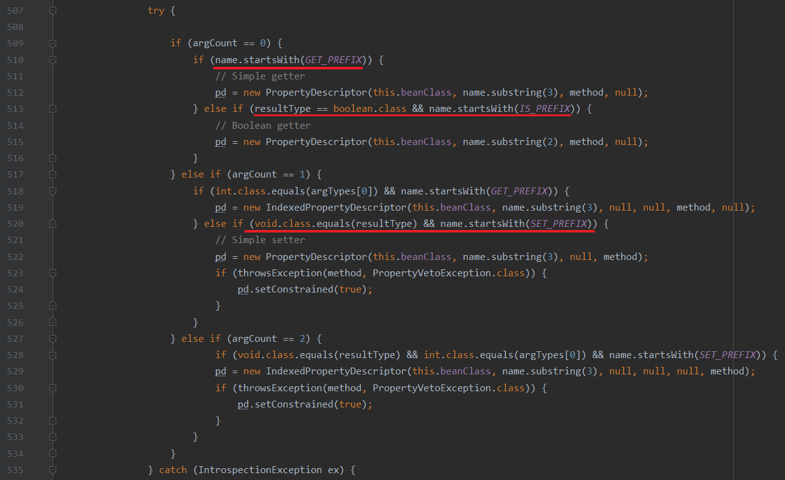

# SnakeYaml的loadAs和dump方法无法正确处理boolean类型的字段

## 问题简述

SnakeYaml的loadAs和dump方法无法正确处理boolean类型的字段。

## 环境

```xml
<dependency>
    <groupId>org.yaml</groupId>
    <artifactId>SnakeYaml</artifactId>
    <version>1.30</version>
</dependency>
```

## 原因和建议



当`SnakeYaml`执行`dump`方法或`loadAs`方法时，获取字段名称的方式是通过方法名称去创建`PropertyDescriptor`。当他处理`boolean`类型的字段时，对其`getter`和`setter`仅仅截去`get`/`is`和`set`，导致获取的字段名称与习惯用法不符。

如果遵循`SnakeYaml`的要求，命名为`isFoo`的`boolean`字段的`getter`和`setter`将形如：`getIsFoo`/`isIsFoo`和`setIsFoo`。

按以上方式定义`isFoo`的`getter`和`setter`将无法被`idea`、`lombok`、`fastjson`等主流产品识别。这时建议定义的`boolean`字段不以`is`开头。